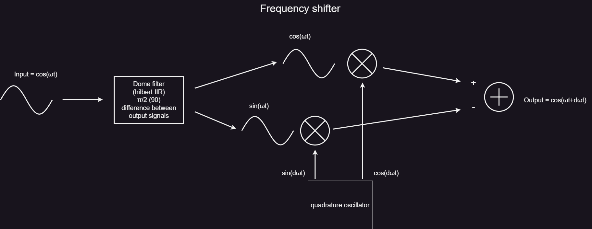

# Phase
Phase Modulator / Frequency Shifter

**Phase** is a program to run on `Electrosmith patch.Init()` that can perform phase modulation 
and frequency shifting by quadrature modulation, as described [here](https://en.wikipedia.org/wiki/In-phase_and_quadrature_components).

## How it works
The incoming signal(s) are fed into a Hilbert transformer, which outputs an in-phase/quadrature pair. We can then phase-shift the signal using a balanced modulator, where we modulate it with another in-phase/quadrature (sin/cos) pair. 

Depending on the blend of the sin/cos pair, we can achieve an arbitrary phase shift of the incoming signal. If we let a signal control the sin/cos blend, we could use that to modulate the phase.

If instead the sin/cos pair are components of a quadrature oscillator, we will get a frequency shifter.

We can use either an internal sine oscillator for the modulation or an external one.

There is also a mode to output only the in-phase and quadrature components for the modulation signal, to be used with another module that performs balanced modulation, such as Joranalogue Collide 4. This means you could use Collide 4 to perform phase modulation as well as frequency shifting.

The inputs, outputs, and controls are as follows:

- **CV_OUT_2/C1 LED**: Lights up when in Mono->Stereo mode (see below).
- **B7**: Switches between modes for the controls CV_1?CV_4 when pressed in (Mono->Stereo or Dual operation).
- **B8**: Up = external oscillator, down = internal oscillator.

### Normal mode (B7 not pressed)
- **CV_1**: Coarse frequency
- **CV_2**: Modulation depth
- **CV_3**: Fine frequency
- **CV_4**: CV modulation depth

### Alternate mode (B7 pressed)
- **CV_1**: Volume of I/Q outputs
- **CV_2**: High-pass filter frequency
- **CV_3**: Mode from CCW to CW:
  - Phase mod 1 stage
  - Phase mod 2 stage
  - Phase mod 3 stage
  - Phase mod 4 stage
  - Frequency shifter
  - I/Q out phase modulation
  - I/Q out frequency shifter
- **CV_4**: Low-pass filter frequency

### CV inputs
- **CV_5**: V/Oct left
- **CV_6**: V/Oct right
- **CV_7**: Mod depth left
- **CV_8**: Mod depth right

### Signal Inputs and outputs
- **IN_L**: Left input
- **IN_R**: Right input/modulation input
- **OUT_L**: Left output / I-output
- **OUT_R**: Right output / Q-output

When **B7** is held, it switches modes. In addition, when using the internal oscillator, it switches between using L/R inputs as dual independent signals or converting **IN_L** to stereo by applying a Hilbert transformer before the modulation. **CV_6** and **CV_8** will only be used when running in dual mode.

**NB**: Since **B7** has a dual function, if you press it to change alternate parameters, you will need to press it again to return to the Mono/Stereo mode you were in before.

### Diagrams

